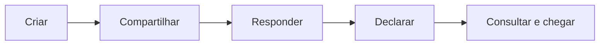

# Bora Lá

O Bora Lá ajuda grupos a transformar a intenção dispersa de fazer um happy hour em um encontro reconhecido como real — sem substituir o WhatsApp, controlar a conversa ou impor como amigos devem decidir.

> Status: Brief, PRD, SPEC, UX e arquitetura concluídos e validados para handoff; MVP ainda não implementado.

## Proposta

Uma pessoa cria um rolê começando por quem topa ou por um local, compartilha um link e deixa o grupo agir com sua dinâmica habitual. O Bora Lá concentra opções, respostas e declarações num estado vivo e consultável.

O princípio central é **organizar sem governar**.

## Documentação

- [Product Brief](./_bmad-output/planning-artifacts/briefs/brief-borala-2026-08-06/brief.md) — problema, público, proposta e visão.
- [PRD](./_bmad-output/planning-artifacts/prds/prd-borala-2026-08-06/prd.md) — requisitos funcionais e não funcionais, métricas, riscos e escopo.
- [Experiência UX](./_bmad-output/planning-artifacts/ux-designs/ux-borala-2026-08-06/EXPERIENCE.md) e [Design](./_bmad-output/planning-artifacts/ux-designs/ux-borala-2026-08-06/DESIGN.md) — jornadas, padrões de interação e direção visual aprovados para handoff.
- [Relatório de validação de UX](./_bmad-output/planning-artifacts/ux-designs/ux-borala-2026-08-06/validation-report.md) — gate aprovado nas três lentes, sem achados críticos, altos ou médios.
- [Architecture Spine](./_bmad-output/planning-artifacts/architecture/architecture-borala-2026-08-07/ARCHITECTURE-SPINE.md) — invariantes, stack e fronteiras técnicas aprovadas.
- [Solution Design](./_bmad-output/planning-artifacts/architecture/architecture-borala-2026-08-07/SOLUTION-DESIGN.md) e [UML](./_bmad-output/planning-artifacts/architecture/architecture-borala-2026-08-07/UML.md) — detalhamento de runtime, domínio, persistência, segurança e implantação.
- [SPEC do MVP](./_bmad-output/specs/spec-borala-mvp/SPEC.md) — contrato canônico de capacidades, restrições e não objetivos.
- [Máquinas de estado](./_bmad-output/specs/spec-borala-mvp/state-machines.md) — fluxos Mermaid normativos.
- [Regras detalhadas](./_bmad-output/specs/spec-borala-mvp/mvp-rules.md) — identidade, respostas, opções, tempo e compartilhamento.
- [Constituição](./CONSTITUTION.md) — princípios permanentes de produto, engenharia e governança.
- [Rascunhos iniciais](./design-artifacts/A-Product-Brief/) — fontes históricas de orientação, não normativas.

## Escopo do menor MVP

Incluído:

- identidade verificável e nick contextual;
- criação começando pelas pessoas ou pelo local;
- convite universal por link;
- múltiplas opções manuais de local;
- respostas `Topo`, `Tudo bem`, `Não tenho certeza` e `Não vou nesse`;
- declarações humanas, correções auditadas e cancelamento terminal;
- compartilhamento manual, endereço, URLs e rota durante o encontro.

Adiado:

- grupos persistentes, point e memória;
- descoberta assistida, mapas e avaliações;
- chat, notificações e integrações automáticas;
- reservas, publicidade, pagamentos e monetização;
- festas, fotos, desfecho e comparecimento.

## Premissas de engenharia

- Comunicação e documentação em Português do Brasil.
- Nomes de arquivos e identificadores de código em inglês.
- React.js no frontend; TanStack apenas quando houver ganho real.
- TDD obrigatório e Cypress para testes E2E.
- Orientação a objetos com Clean Code, Object Calisthenics, SOLID, Lei de Demeter e composição sobre herança.
- Runtime em Node.js, aplicação React Router em Framework Mode e persistência MySQL, conforme a arquitetura aprovada.

## Próximos passos

1. Executar `[CE] Create Epics and Stories` com `bmad-create-epics-and-stories`.
2. Executar `[IR] Check Implementation Readiness` com `bmad-check-implementation-readiness` para conferir o alinhamento entre PRD, UX, arquitetura e histórias.
3. Executar `[SP] Sprint Planning` com `bmad-sprint-planning`.
4. Implementar cada história pelo ciclo Create Story → Validate Story → Dev Story → Code Review, com TDD e testes E2E.
