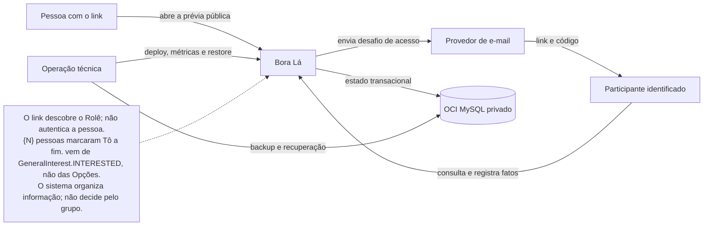
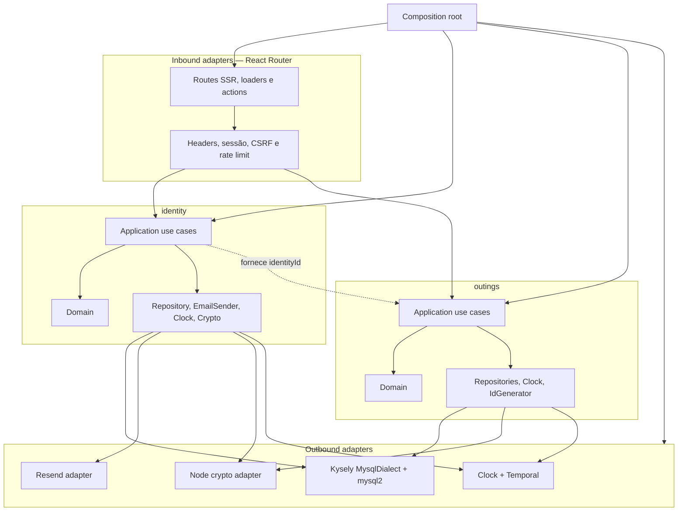
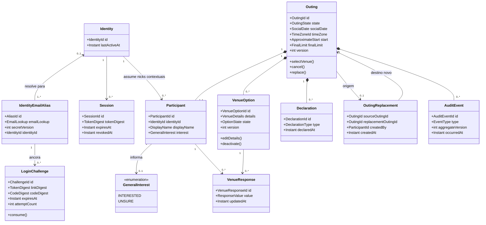
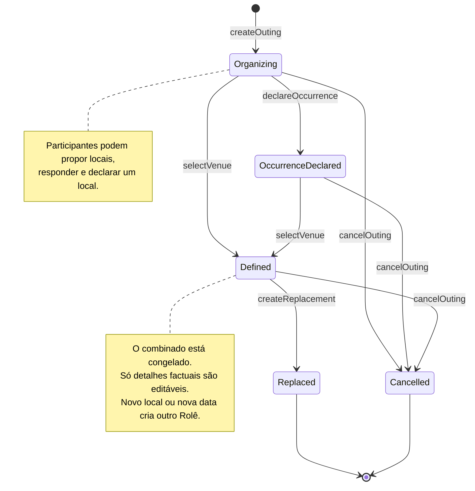
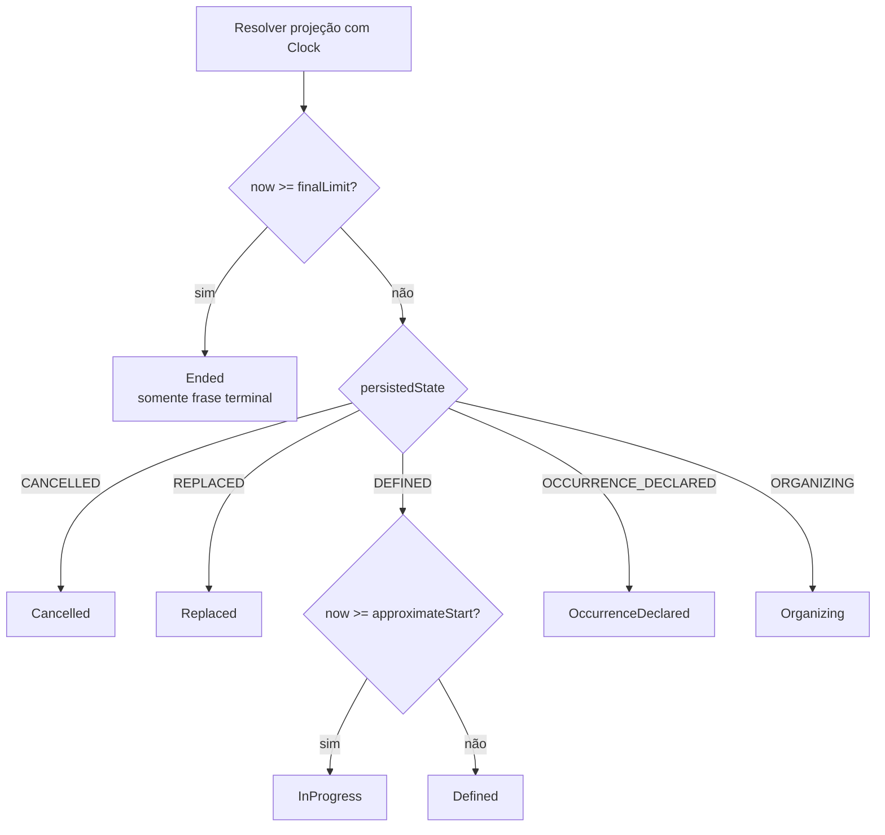
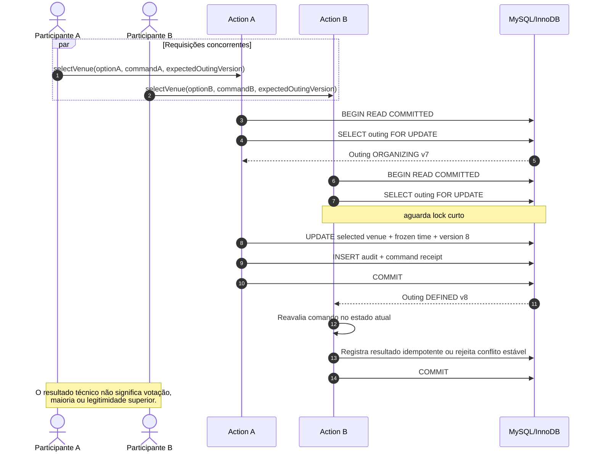
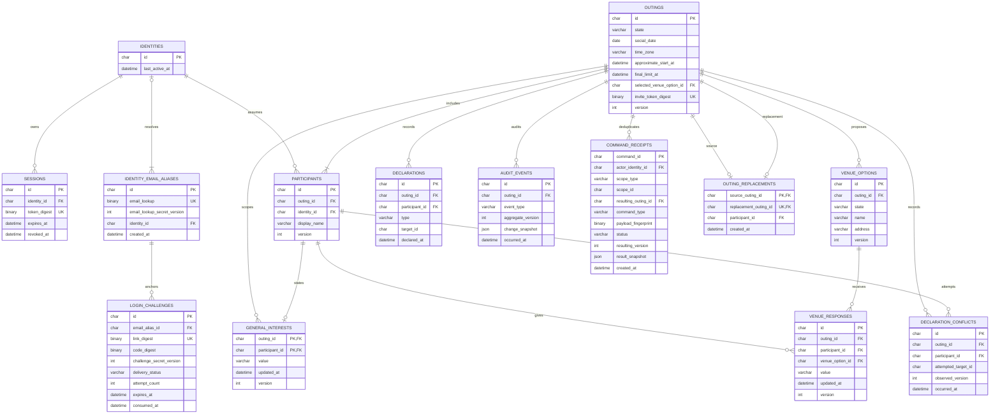
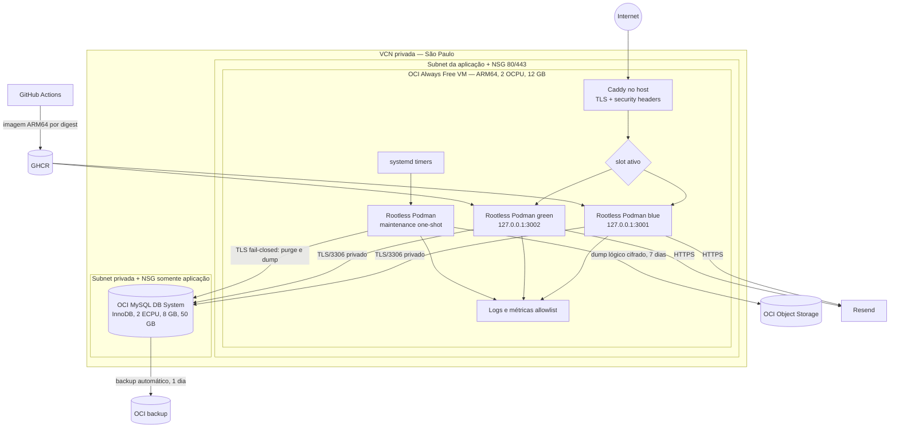
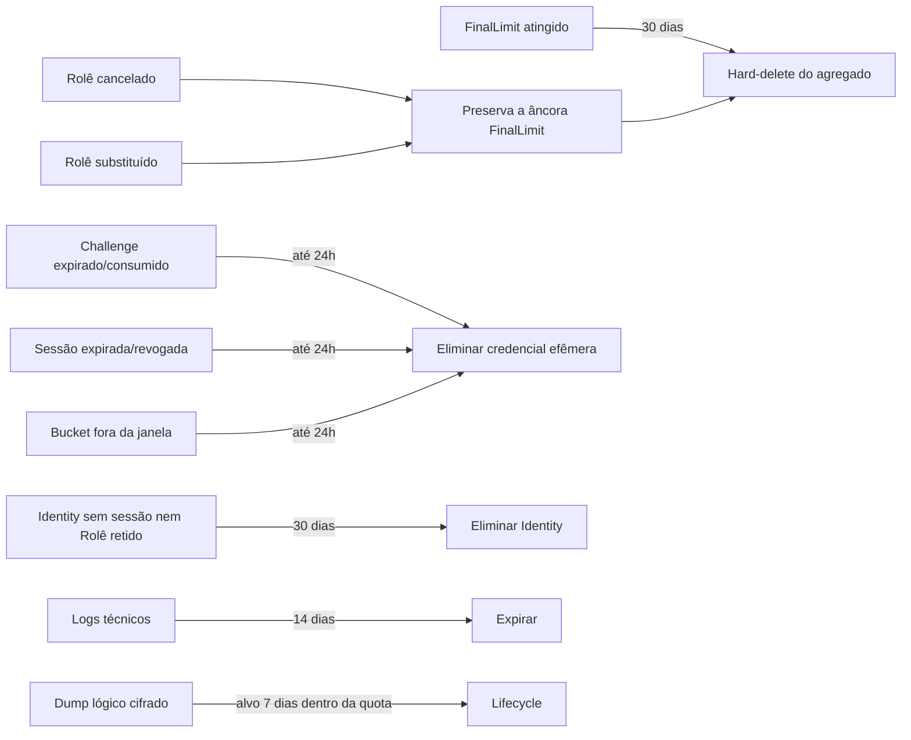

# UML e vistas arquiteturais — Bora Lá

Estes diagramas complementam o [Architecture Spine](./ARCHITECTURE-SPINE.md) e o [Solution Design](./SOLUTION-DESIGN.md). Eles descrevem fronteiras, dependências e sequências que afetam decisões de implementação. Em caso de divergência textual, o spine e as fontes normativas prevalecem.

## 1. Contexto do sistema



## 2. Componentes e dependências



As setas representam dependência em runtime. No código, `domain` não importa framework, adapter ou banco; a composição concreta ocorre somente no composition root.

## 3. Modelo de domínio essencial



`SelectedVenue` é uma referência imutável à opção declarada no Rolê. Alterar `VenueDetails` corrige somente os fatos descritivos da mesma opção; trocar o local social exige `ReplacementOuting`.

## 4. Estado persistido e estado efetivo

### 4.1 `PersistedOutingState`



Não há cron, evento ou coluna para persistir `InProgress` ou `Ended`. Edição factual não muda o estado. `Cancelled` e `Replaced` são terminais para comandos.

### 4.2 `EffectiveOutingViewState`



O purge usa `final_limit_at`, não um estado `ENDED`. A indisponibilidade visual de ações nunca substitui a policy no servidor.

## 5. Identificação por e-mail

```mermaid
sequenceDiagram
    autonumber
    actor P as Pessoa
    participant B as Browser
    participant W as Web action
    participant I as Identity service
    participant M as MySQL
    participant E as Provedor de e-mail

    P->>B: Abre Convite
    B->>W: GET /r/:inviteToken
    W->>M: Busca por SHA-256 do token
    M-->>W: PublicInviteView
    W-->>B: Resumo público + no-store
    P->>B: Informa e-mail
    B->>W: POST request-login
    W->>I: requestLogin(normalizedEmail)
    I->>M: Aplica limites e persiste digests
    I->>E: Envia link e código
    I-->>W: Resultado neutro
    W-->>B: Confirmação neutra

    alt Link recebido
        P->>B: Abre link
        B->>W: GET verify-link
        W-->>B: Confirmação; GET não consome
        P->>B: Confirma continuar
        B->>W: POST consume-link
    else Código recebido
        P->>B: Digita código
        B->>W: POST verify-code
    end

    W->>I: consumeChallenge()
    I->>M: Bloqueia challenge e valida digest, prazo e tentativas
    I->>M: Cria/recupera Identity e emite Session
    M-->>I: Commit
    I-->>W: Token opaco de sessão
    W-->>B: Cookie Secure, HttpOnly, SameSite=Lax
    B->>W: Retorna ao mesmo Convite
    W-->>B: Solicita/reutiliza Nick contextual
```

O endereço de e-mail não é exposto ao módulo `outings`, aos demais participantes, aos logs ou à auditoria do Rolê.

## 6. Declaração concorrente de local



Se os dois comandos declaram exatamente a mesma opção, o segundo pode retornar sucesso idempotente. Se declaram opções distintas, o segundo recebe erro de conflito e a projeção atual, sem sobrescrever a primeira transição.

## 7. Troca de local ou data após a definição

```mermaid
sequenceDiagram
    autonumber
    actor P as Participante identificado
    participant W as Web action
    participant O as Outing service
    participant DB as MySQL

    P->>W: Criar outro Rolê
    W->>O: createReplacement(sourceOutingId, commandId)
    O->>DB: BEGIN + lock source outing
    O->>O: Valida identidade, prazo e estado
    O->>DB: Cria novo Outing + novo token de Convite
    O->>DB: Marca origem como Replaced
    O->>DB: Persiste vínculo, audit e receipt
    O->>DB: COMMIT
    O-->>W: ReplacementCreated(newInvite)
    W-->>P: Novo Convite; sem herdar interesse ou respostas
```

Antes da definição, os detalhes da opção podem ser alterados. Depois da definição, `Editar detalhes` preserva a identidade social do local e modifica apenas nome, endereço ou URLs; para outro local ou outra data, a ação disponível é `Criar outro Rolê`.

## 8. Modelo relacional



Os tipos ilustram intenção, não substituem migrations. Em `IDENTITY_EMAIL_ALIASES`, a unique key é composta por `(email_lookup_secret_version, email_lookup)` e `identity_id` pode ser null antes do primeiro consumo. O e-mail normalizado existe em memória somente durante emissão/entrega; a persistência usa lookup keyed, e tokens persistem somente como digest. URLs ficam na tabela normalizada `venue_option_urls`; revisões e tabelas operacionais omitidas desta vista estão enumeradas no Solution Design. URLs e endereços pertencem ao dado de negócio e nunca entram em logs técnicos.

## 9. Implantação



O banco não possui endpoint público nem HA no envelope gratuito. O deploy troca apenas o slot depois de migration forward-compatible, readiness e smoke; restore em ambiente limpo verifica objetivos best effort de RPO 24h/RTO 4h.

## 10. Retenção



Os jobs são idempotentes e processam lotes limitados. Nenhum dado de autenticação é preservado por auditoria de domínio.
