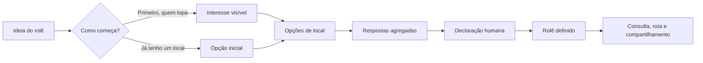

# Product Brief: Bora Lá

## Resumo executivo

O Bora Lá ajuda grupos recorrentes a transformar a intenção dispersa de fazer um happy hour em um encontro que as pessoas reconhecem como real. O problema não nasceu com o WhatsApp: café, ramais, CC:Mail e mensageiros diferentes apenas hospedaram a mesma dinâmica — respostas tardias, preferências conflitantes, confirmações pouco confiáveis e uma decisão que costuma surgir por adesão, insistência ou iniciativa de quem realmente vai.

O produto não pretende substituir a conversa nem determinar como amigos devem decidir. Ele mantém um estado compartilhado do rolê: quem foi convidado, quais locais estão em avaliação, como o grupo reagiu e se alguém já declarou que vai ter rolê. A proposta central é **organizar sem governar**.

O primeiro objetivo do Bora Lá é servir como vitrine de portfólio e validar um produto gratuito. Monetização, integrações automáticas e recursos para festas permanecem hipóteses futuras, condicionadas ao uso real.

## Problema

No happy hour espontâneo, a desistência raramente decorre de uma única barreira. Ela surge da combinação de rejeição ao local, demora para decidir, falta de confirmação de quem irá, mudança de planos e pouca vontade. Distância e preço influenciam em contextos específicos, mas não explicam sozinhos o comparecimento.

Algumas presenças funcionam como âncoras sociais: pessoas que falam pouco, mas comparecem quando confirmam. Outras esperam duas, três ou quatro confirmações relevantes antes de aderir. O organizador inicia a conversa, mas nem sempre é quem mobiliza o grupo. O encontro ganha realidade quando alguém declara: “nós vamos; quem quiser está convidado”.

## Proposta de solução

O Bora Lá acompanha a conversa no canal em que ela já acontece. Uma pessoa cria um rolê começando pelas pessoas ou por um local e compartilha um link. Convidados identificam-se, escolhem um nick contextual e respondem às opções sem expor contato.

Cada opção recebe quatro respostas: `Topo`, `Tudo bem`, `Não tenho certeza` e `Não vou nesse`. `Topo` é nominal e produz prova social; as demais respostas aparecem somente de forma agregada. O sistema não calcula quórum, não proclama vencedor e não interpreta silêncio.

## Para quem

O público inicial são grupos recorrentes que organizam happy hours espontâneos. Dentro deles, o produto serve especialmente:

- quem inicia a conversa e hoje contabiliza respostas manualmente;
- quem só adere quando percebe que o encontro realmente acontecerá;
- quem deseja propor ou rejeitar um local sem dominar a conversa;
- convidados externos que precisam consultar o plano vigente sem acompanhar todo o histórico do canal.

## Princípios de experiência

- Organizar sem governar.
- Começar pelas pessoas ou pelo local, sem impor uma sequência.
- Exibir consequências sem decidir pelo grupo.
- Usar identidade verificável sem expor dados de contato.
- Aceitar que o WhatsApp ou outro canal continue sendo o palco da conversa.
- Manter horários humanos e aproximados, sem precisão artificial.
- Preservar autoria e histórico sem criar mecanismos de controle social excessivos.
- Cobrar complexidade apenas quando ela entregar valor real.

## Escopo do MVP

O MVP inclui identidade verificável, nick contextual, criação de rolê, convite por link, interesse geral, múltiplas opções manuais de local, respostas em quatro níveis, declarações humanas, correções auditadas, cancelamento terminal, compartilhamento manual e consulta operacional durante o encontro.

O MVP não inclui grupos persistentes, point, memória, notas livres, descoberta assistida, mapas embutidos, chat, notificações automáticas, integrações, reservas, publicidade, monetização, festas, fotos ou registro de desfecho.

## Sinais de sucesso

O MVP terá demonstrado sua hipótese quando um grupo conseguir:

- criar e compartilhar um rolê sem configurar previamente um grupo;
- formar adesão visível e comparar locais sem votação automática;
- declarar um rolê e manter um link confiável para consulta e rota;
- usar o produto sem abandonar seu canal social;
- compreender quem pode agir e o que cada estado significa sem instrução externa.

A relação com comparecimento será validada inicialmente por pesquisa com usuários e observação, pois o MVP não coleta presença nem desfecho.

## Visão posterior ao MVP

Se o núcleo gratuito ganhar uso, o Bora Lá poderá incorporar memória consentida de grupos, point, notas históricas, descoberta por região ou ponto calculado, mapas e pesquisa de interesse por integrações. Monetização só será discutida com evidência de uso; integração com WhatsApp é uma hipótese futura, não compromisso atual.
