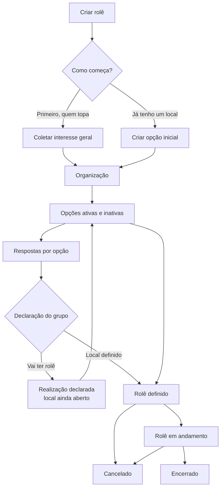
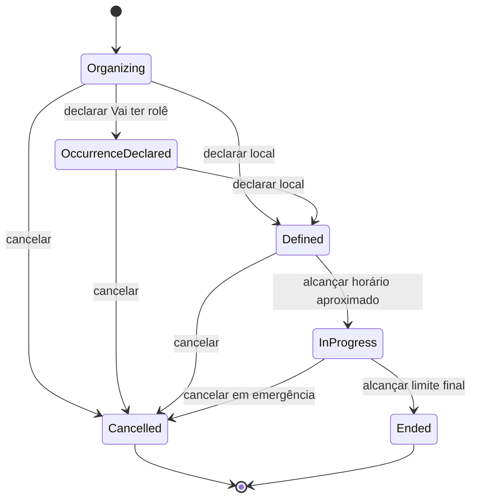
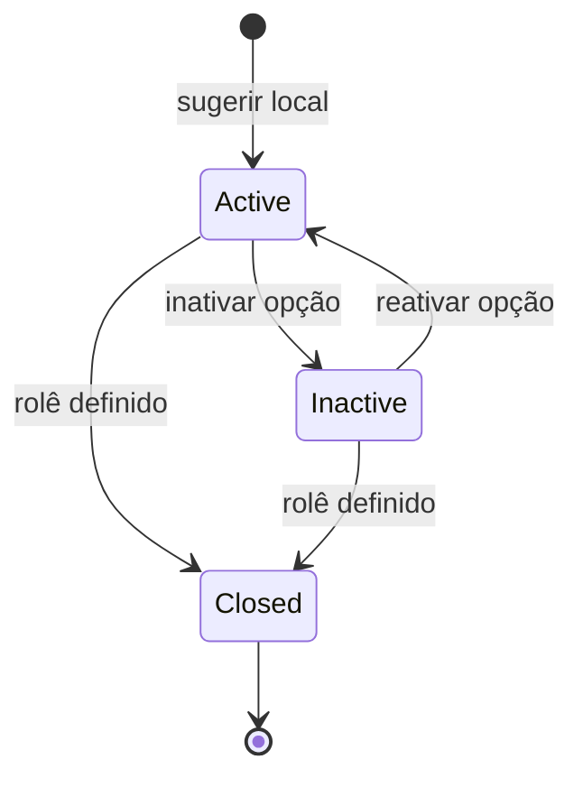
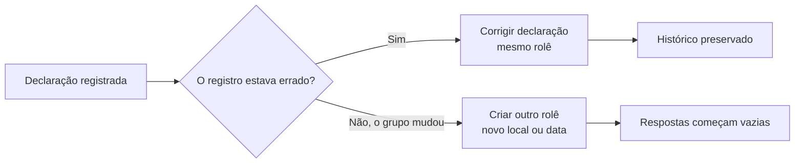

# Máquinas de estado do MVP

Este companion é parte normativa da [SPEC](./SPEC.md).

## Jornada principal



## Estados do rolê



`Cancelled` é terminal. Não existe restauração no MVP.

## Estado de uma opção



`Closed` preserva dados, respostas e histórico, mas não aceita novas ações sobre a opção.

## Correção e outro rolê



## Concorrência de declarações

```mermaid
sequenceDiagram
    participant Ana
    participant BL as Bora Lá
    participant Bruno
    Ana->>BL: Declara X-Bar
    Bruno->>BL: Declara Bar Y sobre a mesma versão
    BL-->>Bruno: Informa conflito; X-Bar permanece vigente
    BL-->>Ana: Notifica divergência registrada
    Note over Ana,Bruno: O grupo discute no canal externo
    Bruno->>BL: Corrige declaração para Bar Y
    BL-->>Ana: Histórico mostra declaração e correção
```
